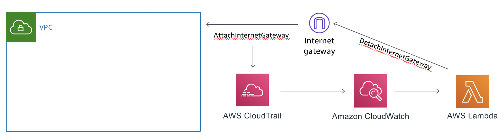
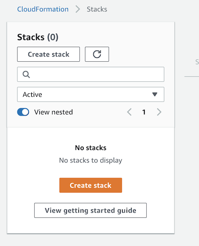

# Scenario 1 - No Internet Gateways!
One item public sector customers must control very tightly is the network path their traffic takes to and from the cloud. In DoD orgs, this includes the Cloud Access Point, or in the Federal Civilian space this may include a Trusted Internet Connection point. Other states/government agencies, or educational institutions may have similar requirements depending on thier compliance standards. This lab will help show you how to detect the creation of an internet gateway, and more importantly the attachment of it to a VPC. While we don't necessarily recommend automatically deleting something a user creates, this shows the ability we have to do just that in an automated fashion.

A couple of examples of controls that may require this kind of assurance include CIS 4.4 and NIST AC-17(3).

## Pre-requisites
You'll need:

* An AWS account that you can create CloudFormation stacks in, and be able to use Lambda with
    * Make sure this account is one that creating/deleting resources like this won't trip any alarms!
    * Ability to create IAM resources - we'll need a role that allows our function to use CloudWatch logs and detach the gateway
    
Here's a high level graphic of what we're attempting to do:



**PLEASE BE SURE TO USE OREGON (US-WEST-2) FOR THIS LAB!**
You can double check this by looking in the upper right hand corner for the region selection dropdown.

## Deploy the Lambda Function

First, we will need to deploy the Lambda function that deletes the internet gateway attachment. The code for this is a proof of concept, and does not represent a production level function. However, it does perform the task. The CloudFormation script will push the function below:

```python
import json
import boto3

def lambda_handler(event, context):
    vpc_id = event['detail']['requestParameters']['vpcId']
    igw_id = event['detail']['requestParameters']['internetGatewayId']
    ec2 = boto3.client('ec2')
    ret = ec2.detach_internet_gateway(
        DryRun = True,
        InternetGatewayId = igw_id,
        VpcId = vpc_id
    )
    return {
        'statusCode': 200,
        'body': ret
    }
```

Note the `DryRun = True` statement inside the `detach_internet_gateway` function call. This is telling boto (the Python library that interacts with AWS APIs) to not actually delete the attachment, but rather validate that it can. You can change this to `False`, and the function will actually delete the attachment. 

We will quickly install the Lambda function by creating a CloudFormation stack. Launch the AWS CloudFormation Console.

Click Create Stack

 

Specify Amazon S3 as the location for the CloudFormation template, then click next. (https://reinforce2019-grc333-session.s3-us-west-2.amazonaws.com/lambda_vpc_delete.yaml)


Provide a Stack name, and accept the default function name, or modify it to your liking. Click next.


Add any tags you like, or accept all defaults, and click next. 

Review all the details on the final page, then ensure you check the box that says "I acknowledge that AWS CloudFormation might create IAM resources with custom names." This ensures you are allowing CloudFormation to create the necessary IAM role needed to execute, log output, and perform the detaching of the IGW.


At this point, you can choose to create the stack, or if you are not comfortable, feel free to skip it. There will be parts of the lab that will not function, but you can still explore each step regardless of having the function installed. Again, the default is to execute the detach in DryRun mode, so you will not have any destructive actions taken unless you modify that.

##Create CloudTrail

Next we need to ensure we have a CloudTrail created to log the events happening inside our account. 

AWS CloudTrail is a service that enables governance, compliance, operational auditing, and risk auditing of your AWS account. With CloudTrail, you can log, continuously monitor, and retain account activity related to actions across your AWS infrastructure. CloudTrail provides event history of your AWS account activity, including actions taken through the AWS Management Console, AWS SDKs, command line tools, and other AWS services. This event history simplifies security analysis, resource change tracking, and troubleshooting.

You can read more about CloudTrail [here](https://aws.amazon.com/cloudtrail/).

Launch the CloudTrail console, and click "View Trails", followed by "Create Trail". If you already have one, ignore it and create a new Trail. We'll use that new trail to feed events into CloudWatch.

We'll want to specify a trail name to ensure we know what we created here. Select yes for "Apply trail to all regions".


For this lab, we'll skip the Data Events section. However, this is a powerful tool to help audit S3 and Lambda invocations and is worth further exploration in the future.

For a storage location, select an existing bucket you have, or have the console create a new one for you. Be sure to click the advanced tab, and select the following:

* Bucket name: something unique if you're using a new bucket
* If you want this trail to be unique in a shared bucket, you can have CloudTrail prefix the files to identify them
* You can select KMS encryption to protect the data in these logs (this is required by NIST and CIS Benchmark)
    * You can specify a key for this trail, or use an existing KMS key
* Logfile validation will create a digest of all logs with hashes of each in it. This will help you validate provenance of each logfile to determine if it was tampered with
* If you want a notification for each file to be sent with SNS (to trigger an ingest task in a SIEM or other tool) you can choose yes.


Once you're happy with the configuration, click "Create".

###Configure Cloudwatch Logs for your new CloudTrail

Once we've created our CloudTrail, we need to configure integration with CloudWatch Logs. This ensures we can create things like CloudWatch Events that will fire when a given action is seen, or for more advanced/long term retention, as well as search capability.

From the CloudTrail console, find your newly created Trail, and click on its name.


Scroll down until you see CloudWatch Logs, and click Configure.


Specify the name of the Log Group you'd like your CloudTrail activity to be kept in by CloudWatch Logs. Click Continue.


In order for CloudTrail to deliver logfiles to CloudWatch, you must create a new role for CloudTrail so it has permission to write the logs. Click View Details to see the IAM role that is proposed for creation, then select Allow if you are okay with it.


Once you've clicked allow, the CloudTrail console will validate the role, create the new log group, and begin delivering logs. There may be a delay in the delivery of logs, but all events will now go to CloudWatch logs. You will see that configuration is successful similar to the screenshot below.


##Configure CloudWatch Events

Once our CloudTrail is built, and we have it sending logs to CloudWatch, we need to configure an event to detect our Internet Gateway attach action.

Go to the CloudWatch console, and select Logs. Once there, look for the Log Group we specified in the CloudTrail created earlier.


Click on the Log Group name. This will open the list of log streams that contain events being sent to CloudTrail. 


Click on a log stream in the list. Once in the stream, you will see the events that have been streamed in. You can click on one of the events to see its detail.


The event we are looking for is the AttachInternetGateway action. This shows us that someone has created a way to allow routing of traffic out from a VPC. Since we want to control this traffic (CIS 4.4, NIST AC-17(3)), we want to in this case react by removing the attachment automatically.


In the screenshot above, you can see the eventName called `AttachInternetGateway`. This is the action we want to capture. In order to do so, we need to create a CloudWatch Event. When CloudWatch sees this event pop up in a log sent to it by CloudTrail, it will execute an action that we specify. In this case, we will execute our Lambda function that will detach the gateway. As indicated above, the function is set to `DryRun = True`, so we will not actually perform the delete.

To configure the CloudWatch event, click on Events in the left hand column in the CloudWatch console..


Once you click Events, click Get Started. This will launch the CloudWatch Event dialog.

We want to ensure that "Build event pattern to match events by service" is selected. 

Drop down the services box, and select EC2. Event Type should be "AWS API Call via CloudTrail". We want to select Specific Operation(s), and in the boxes below put in `AttachInternetGateway`.


In the Targets column, we will specify that this Event firing will send the log data to Lambda to feed our Detach function. Click Add Target, then ensure Lambda function is selected. Drop down the function box, and select the Lambda function we created earlier. 


Once you're happy with the configuration, click "Configure details" at the bottom of the screen.

Let's recap what we've done so far.

* We've created a Python based Lambda function that will delete a specified Internet Gateway Attachment.
* We've created a CloudTrail that you can use to log API activity in your account, and configured sending it to CloudWatch Logs.
* We've configured a CloudWatch Events Rule that fires our Lambda function when it detects an `AttachInternetGateway` action.


##Testing our setup!

Now it's time to test out this setup. To simulate this, we're going to deploy another CloudFormation Stack.

This stack deploys the setup above, but here it is again for your reference:


The CloudFormation template creates a VPC, and an Internet Gateway. It then attaches the Internet Gateway to the VPC. That's it. No subnets or any other constructs. It does specify 10.10.0.0/16 as the default CIDR. Please validate that as one you can use in your account. 

Open the CloudFormation Console, and deploy the following stack from S3:   https://reinforce2019-grc333-session.s3-us-west-2.amazonaws.com/NewVPC-CFN.yaml


Enter a stack name, and validate the CIDR block that is pre-populated. Also look at the VPC name and ensure you're happy with that.


Click Next, add any tags or other changes you might want, then click Next again. Review the summary, and click Create stack if you're happy

As the stack runs, feel free to watch it from the CloudFormation console. Note the time that it is finished creating.


Once the stack is completed, we will have a few minutes while CloudTrail receives the logs and sends them to CloudWatch Logs. You can go to CloudWatch Logs, and search for the `AttachInternetGateway` event. You can also monitor the Lambda function logs for the invocation of the function.

Open up the log stream that was created for you by Lambda (it'll be named after your function). Look at the events there. When the function runs, it will indicate that it has failed. This is expected: remember, we set the `DryRun = True` flag in the function. You will see however, that it would have run successfully had we not set that. 


If this event had run live, you could go and look at the VPC configuration, and notice that the Internet Gateway created by the CloudFormation VPC stack has been detached from the VPC. 

##Summary

Control of network traffic flow to many compliance frameworks. This is one example of a way you can use different AWS services to monitor that flow. In our next lab, we'll look at using drift detection in CloudFormation to monitor ports/protocols allowed to a given group of hosts.

To clean up, please remember to do the following tasks:

* Remove the CloudFormation stacks we created - the Lambda function, and the new VPC. Be careful to only delete what we created
* Remove the CloudTrail we created as a part of this lab - be careful not to disturb any others you may have
* Remove the CloudWatch Events rule we created
* Remove the CloudWatch Logs groups created by Lambda and CloudTrail
* Remove the S3 bucket that was created by CloudTrail to store the logs from this trail

This should remove all artifacts of this lab.