#Scenario 2 - Drift Detection 
As public sector customers continue to adopt cloud, the hard work they have done with building secure and compliant architectures must be continuously monitored. Many compliance frameworks mandate this, such as NIST 800-53. CM-7 (a/b) define the need to identify and block ports that are not relavent to the application. As the application operates, ongoing continous monitoring is vital. Organizations must define a plan to perform this monitoring and ongoing auditing. What if you could define these rules, and get an automated notification if the rules change? Instead of trying to track down a rogue user or mistaken administrator, you can quickly be notified of changes, and potentially revert them automatically.

We've already used CloudFormation in Scenario 1 to deploy our resources, and will deploy our resources for this lab with it as well. One new feature of CloudFormation is Drift Detection. Drift is the difference between the expected configuration values of stack resources defined in CloudFormation templates and the actual configuration values of these resources in the corresponding CloudFormation stacks. This allows you to better manage your CloudFormation stacks and ensure consistency in your resource configurations. 

## Pre-requisites
You'll need:

* An AWS account that you can create CloudFormation stacks in
    * Make sure this account is one that creating/deleting resources like this won't trip any alarms!
    
Here's a high level graphic of what we're attempting to do:

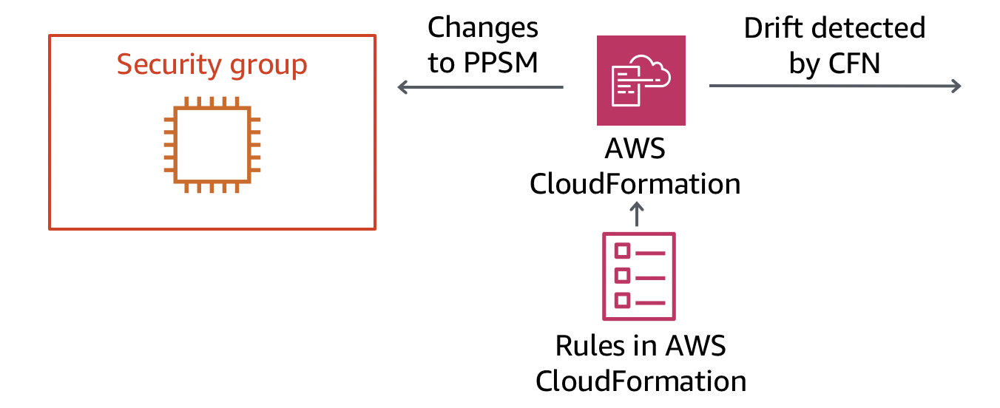

We have a security group that is gating access to our hosts. The rules are specific to ports 22 and 3389 for remote administration only. The security group is configured only to allow a specific IP address. We need to ensure that this security group is not modified except via valid configuration management process. If it is, we want to know about it so that we can be sure only hosts that we want to have access can hit our bastion host group.

**PLEASE BE SURE TO USE OREGON (US-WEST-2) FOR THIS LAB!**

You can double check this by looking in the upper right hand corner for the region selection dropdown.

##Deploy the CloudFormation stack.
First, let's deploy the stack that will provide the base for this lab. The CloudFormation stack will deploy a VPC with no resources or attachments in it. We need a VPC to associate a security group with. It will then deploy a security group that has two rules - one for RDP and one for SSH locked to a given IP.

Launch the CloudFormation console, and create a new stack. 

Click Create Stack

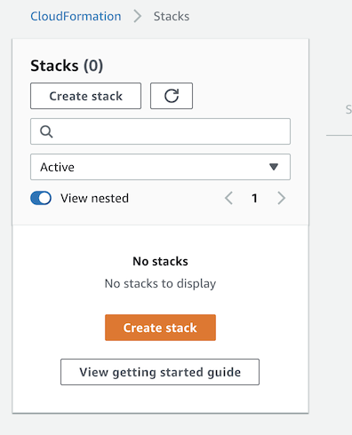 

Specify Amazon S3 as the location for the CloudFormation template, then click next. (
https://reinforce2019-grc333-session.s3-us-west-2.amazonaws.com/security-group.yaml)

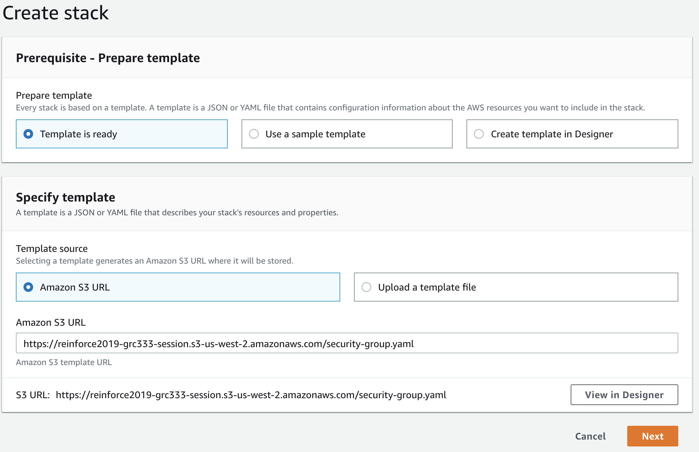

Provide a stack name, and edit the VPC name if you desire.

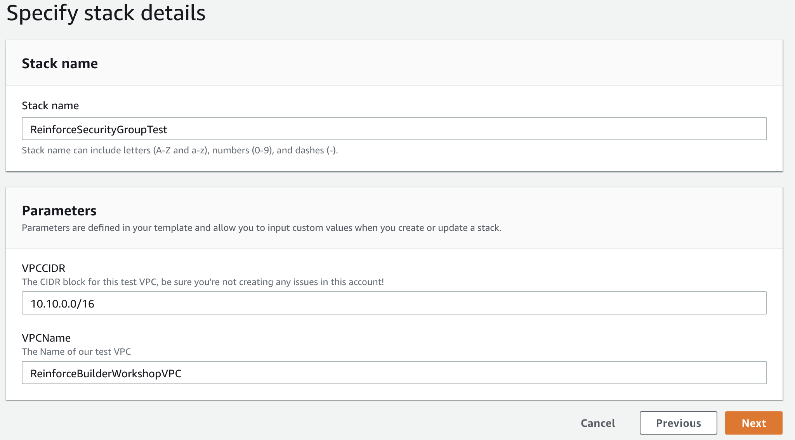

Configure any stack options/tagging you wish to set. Click Next.

Review the stack details, then click Next when you are satisfied.

##Change the Security Group
In order to see how CloudFormation Drift Detection works, we need to introduce a change to our security group the CloudFormation stack has created. 

Open the EC2 console, and look for Security Groups on the left hand side under Network & Security.

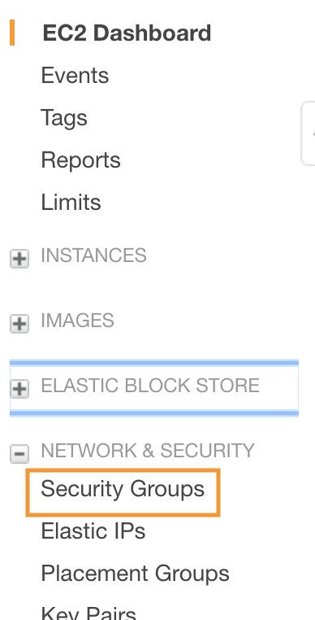

Click Security Groups, and find the Security Group created by CloudFormation. It will be prefixed by the CloudFormation stack name, followed by a unique identifier.

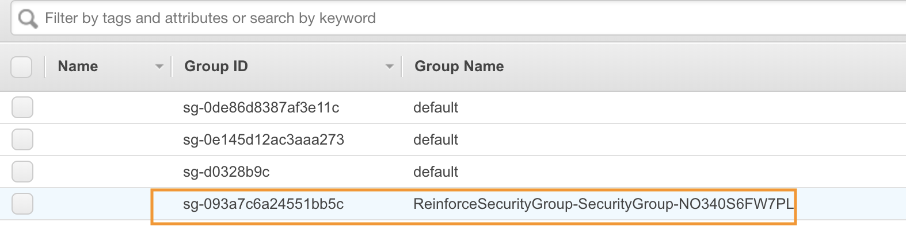

Once you click the Security Group, a menu below will appear. Click the Inbound tab, and review the rules there.

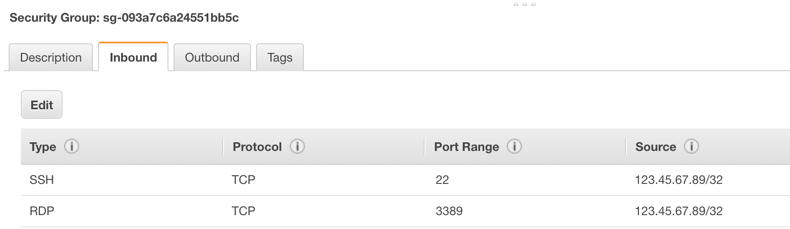

Notice the rules are set to only allow a single host. Click the Edit button so we can adjust the rule to deviate from the stack as it was deployed.

Once you click edit, choose one of the rules, and change the Source to Anywhere. This will open this Security Group to allow ALL destinations on the port specified.

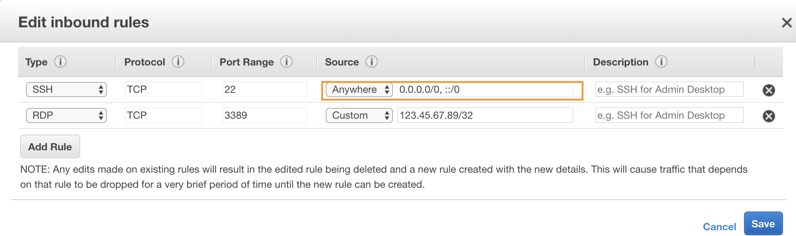

Click Save. You should see the rule update in the Inbound tab. You may also see a "::/O" rule show up - this is an IPv6 rule that can be ignored.

##Detect Drift
Now that a change has been made, let's see how CloudFormation can help us detect this.

Launch the CloudFormation console, and find the stack we created for the Security Group. Click Stack Actions, and View Drift Results.

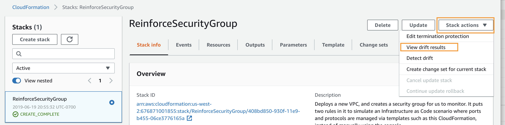

This will show the drift status for the stack. As you can see, we haven't run drift detection yet, so it will indicate `NOT_CHECKED`.

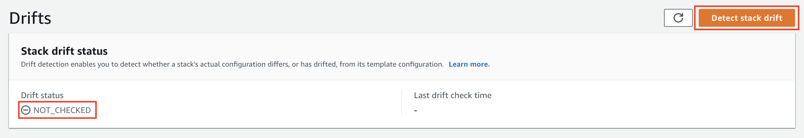

Click the button "Detect stack drift". This will start drift detection. Click the refresh button next to the "Detect stack drift" button. You will see the Resource drift status update, and the Security Group marked as `MODIFIED`. Select the radio button next to the Security Group, and click "View drift details".

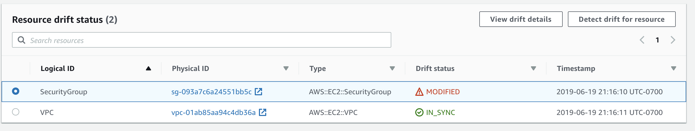

Notice the detected drift items. When changing the Source in the Security Group to All, the Security Group changed the CidrIp of the rule. This is indicated by the `REMOVE` of the expected IP address, and the `ADD` of the new ingress rule. 

You can also see the changes reflected in the JSON in the Details pane of the screen.

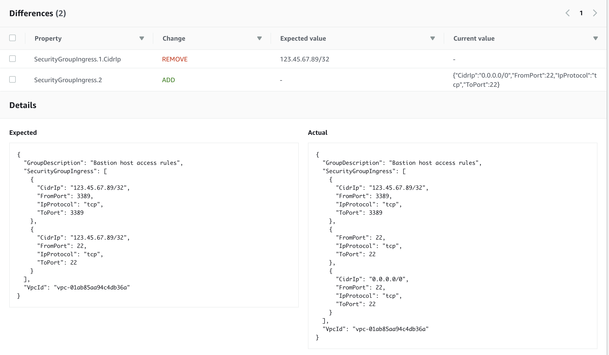

#Summary
In this lab we created some resources using CloudFormation using an Infrastructure as Code pattern. We modified that stack by changing the IP in one of the rules. Once we ran CloudFormation Drift detection, we saw the changes highlighted as a variance from the stack that was originally deployed.

These stack changes can be tracked and alerted on so that compliance and security teams can programatically detect and react to changes that are unauthorized or done without going through the proper change control process. 

To clean up from this lab, delete the CloudFormation stack we created earlier.

