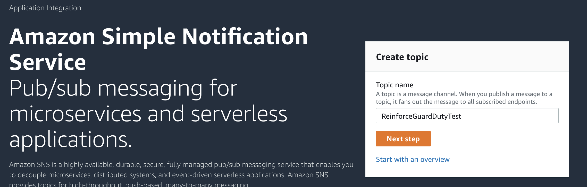

#GuardDuty - Continuous Monitoring of Cloud Security
Amazon GuardDuty is a threat detection service that continuously monitors for malicious activity and unauthorized behavior to protect your AWS accounts and workloads. With the cloud, the collection and aggregation of account and network activities is simplified, but it can be time consuming for security teams to continuously analyze event log data for potential threats. With GuardDuty, you now have an intelligent and cost-effective option for continuous threat detection in the AWS Cloud. The service uses machine learning, anomaly detection, and integrated threat intelligence to identify and prioritize potential threats. GuardDuty analyzes tens of billions of events across multiple AWS data sources, such as AWS CloudTrail, Amazon VPC Flow Logs, and DNS logs. With a few clicks in the AWS Management Console, GuardDuty can be enabled with no software or hardware to deploy or maintain. 

Many control families require automated mechanisms to assist in the tracking of security incidents and in the collection and analysis of incident information. See NIST IR-5(1), CIS 3.1. By integrating with AWS CloudWatch Events, GuardDuty alerts are actionable, easy to aggregate across multiple accounts, and straightforward to push into existing event management and workflow systems.

## Pre-requisites
You'll need:

* An AWS account that you can create CloudFormation stacks in
    * Make sure this account is one that creating/deleting resources like this won't trip any alarms!
    
Here's a high level graphic of what GuardDuty ingests to provide us with situational awareness. 

In this lab, we'll be looking at sample findings and using CloudWatch to provide us with alerts of any security events. Similar to Scenario 1, you could use Lambda to react automatically to these events.

**PLEASE BE SURE TO USE OREGON (US-WEST-2) FOR THIS LAB!**

You can double check this by looking in the upper right hand corner for the region selection dropdown.

##Activate GuardDuty

First, we need to turn on GuardDuty. By default it is turned off.

In the AWS Console, search for GuardDuty, and click on it. 

When you first configure GuardDuty, you will be presented the option to Enable GuardDuty, and view the IAM role needed to operate it.

You can view the IAM role needed for the service by clicking View service role permissions.

Once you're happy with the role, click Enable GuardDuty to get it started.

Initially there will be no findings available. We will generate sample findings in order to see how the tool functions. Prior to that however, click settings in the left hand menu to see some configuration options for GuardDuty. From here you can configure CloudWatch events integration, generate sample findings, and see what the GuardDuty free trial will cost after the 30 day trial period.

##Set up SNS Topic
We want to set up an SNS topic so that the GuardDuty findings that are sent to CloudWatch Events have a place to go. Amazon Simple Notification Service (SNS) is a highly available, durable, secure, fully managed pub/sub messaging service that enables you to decouple microservices, distributed systems, and serverless applications. Amazon SNS provides topics for high-throughput, push-based, many-to-many messaging. Using Amazon SNS topics, your publisher systems can fan out messages to a large number of subscriber endpoints for parallel processing, including Amazon SQS queues, AWS Lambda functions, and HTTP/S webhooks. Additionally, SNS can be used to fan out notifications to end users using mobile push, SMS, and email. 

Go to the console, and find SNS. Pick a topic name, and click Next step.

Flesh out the details of the topic, then continue.

Once the topic is created, you'll want to create a subscription. Click the create subscription button, and pick a notification method. 

In this example I've chosen to use email notification of my GuardDuty findings.

##Configure CloudWatch Events rule
Once an SNS topic is configured, we need to confiugre a CloudWatch Events rule to send findings to our new topic.

Open CloudWatch in the console, and look for CloudWatch Events, and click Rules.

Create a new rule to take in our GuardDuty events. Make sure event pattern is selected, and GuardDuty finding are selected.

Select as a target our SNS topic we created earlier.

Finish up creation of the rule.

##Test GuardDuty with sample findings

Next, we will generate sample findings to see what kinds of alerts GuardDuty generates. 

Go back to GuardDuty in the AWS console, and select Settings, and look for Generate Sample Findings.

Once you've clicked the button, head back to the main GuardDuty console to review the findings created. Note the differing severities, and types there.

Since we have generated Sample findings, we will not get email alerts on our CloudWatch rule. As an exercise, look at the sample findings and think about how you might remediate these, and ways you can prevent them from happening.

##Cleanup
To clean up this lab:

* Delete the CloudWatch Events rule we created
* Disable GuardDuty in GuardDuty/settings.

